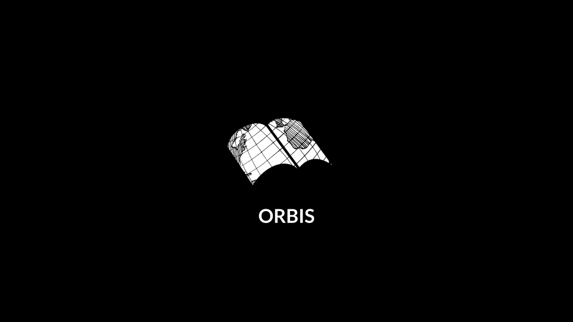

# Orbis 🌎📓 (Group 15)

## What we're doing
Building an elegant, compact **Bullet Journal** application for CSE 110 in Spring 2021

## Who we are
**Jonathan Zamora**
Third-year Computer Science major in Warren, and I enjoy working on AI research projects.

Github Site: https://jonzamora.dev/CSE110-Lab1/

**Rahul Dadlani**
Third-year Math-CS major in Sixth and I enjoy videography

Github Site: https://rahuldadlani03.github.io/GitHub-Pages-Project/

**Joshua Wang**
Second-year CS major in Muir, and I like to draw in my free time.

Github Site: https://joshu-wa.github.io/

**Dylan Cullen**
Third-year CE major, d&d nerd

Github Site: https://dcullenucsd.github.io/cse110lab1/

**Zain Khan**
Second year Math-CS major in ERC, and I love to play basketball 

Github Site: https://zainnk902.github.io/zainkhan/

**Martin Cheung:** 
Second-year CS major in Warren, I love bouldering in my spare time

Github Site: https://martintcheung.github.io/

**Emily Jewik**
Second-year CS major in Sixth, and I like to bake!

Github Site: https://ejewik.github.io/user-page/

**Tejasvin Mukesh**
Second-year CS major in ERC, In my free time I love to binge-watch Netflix.

Github Site: https://tmukesh2809.github.io/LAB1UserPage/

**Vivian Yan**
Second-year CS major in Marshall, and I love visiting plant nurseries!

Github Site: https://v2yan.github.io/cse110-lab1/

## Values we think are important	

- Familiar yet Innovative
- Intuitive Design
- Minimalism
- Accessible (A11Y)
